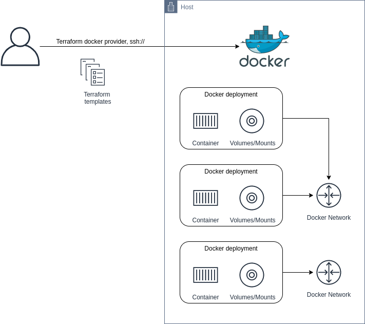

# (Raspberry Pi) Home Server Setup as Code

Using the Docker provider for Terraform to deploy Docker Infrastructure (Images, Containers, Networks, Volumes).

Because my/the server is using a microSD card one focus is to minimize disk read/write activity. Therefore, a lot of tmpfs devices are used where possible.

I am also using 
* <https://github.com/bobafetthotmail/folder2ram> to further reduce disk read/writes of the OS
* <https://github.com/cloudalchemy/ansible-node-exporter> to install the Node Exporter for gettng Prometheus Metrics

## Instructions

Adjust the variables in `variables.tf` and remove all the `.tf` files of services which you don't need.

Then, run `terraform init` and `terraform apply`.